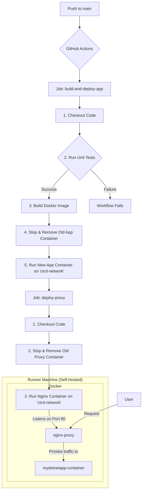

# Tài Liệu Luồng CI/CD

Tài liệu này mô tả chi tiết về quy trình Tích hợp và Triển khai Liên tục (CI/CD) của dự án, được thiết lập thông qua GitHub Actions. Luồng công việc này tự động hóa việc kiểm thử, xây dựng và triển khai ứng dụng .NET cùng với một reverse proxy Nginx.

## Tổng Quan

Luồng CI/CD được thiết kế để tự động triển khai phiên bản mới nhất của ứng dụng mỗi khi có thay đổi được đẩy lên nhánh `main`. Quy trình này đảm bảo rằng mọi thay đổi đều phải vượt qua các bài kiểm thử đơn vị (unit tests) trước khi được triển khai, giúp duy trì sự ổn định của sản phẩm.

Toàn bộ quá trình chạy trên một `runner self-hosted`, nghĩa là môi trường build và deploy được quản lý trên máy chủ của chúng ta.

## Kích Hoạt (Trigger)

Workflow sẽ tự động được kích hoạt khi có bất kỳ lệnh `push` nào vào nhánh `main` của repository.

## Chi Tiết Luồng Công Việc

Workflow được định nghĩa trong file `.github/workflows/local-deployment.yml` và bao gồm hai `jobs` chính chạy tuần tự:

1.  `build-and-deploy-app`: Xây dựng và triển khai ứng dụng .NET.
2.  `deploy-proxy`: Triển khai Nginx reverse proxy sau khi ứng dụng đã chạy thành công.

---

### Job 1: `build-and-deploy-app`

Job này chịu trách nhiệm kiểm thử, đóng gói ứng dụng vào Docker image và chạy nó dưới dạng một container.

**Các bước thực hiện:**

1.  **Checkout Repository**: Tải mã nguồn từ repository về runner.
2.  **Run Unit Tests**: Chạy toàn bộ các bài kiểm thử đơn vị (unit tests) trong solution (`MyDotNetApp/MyDotNetApp.sln`). **Nếu bất kỳ test nào thất bại, workflow sẽ dừng lại ngay lập tức.** Đây là một bước quan trọng để đảm bảo chất lượng code.
3.  **Build Docker Image**: Nếu tất cả các test đều thành công, workflow sẽ xây dựng một Docker image cho ứng dụng từ `Dockerfile` và gắn thẻ (tag) là `mydotnetapp:latest`.
4.  **Stop and Remove Old App Container**: Dừng và xóa container của phiên bản ứng dụng cũ đang chạy (`mydotnetapp-container`) để chuẩn bị cho việc triển khai phiên bản mới.
5.  **Run New App Container**: Chạy một container mới từ image vừa được build. Container này được đặt tên là `mydotnetapp-container` và được kết nối vào một Docker network chung có tên là `cicd-network`.

---

### Job 2: `deploy-proxy`

Job này chỉ được thực thi sau khi `build-and-deploy-app` đã hoàn thành thành công (`needs: build-and-deploy-app`). Nhiệm vụ của nó là chạy Nginx như một reverse proxy, điều hướng traffic từ bên ngoài vào ứng dụng .NET.

**Các bước thực hiện:**

1.  **Checkout Repository**: Tải lại mã nguồn để có thể truy cập vào file cấu hình `nginx/nginx.conf`.
2.  **Stop and Remove Old Proxy Container**: Dừng và xóa container Nginx proxy cũ (`nginx-proxy`) nếu có.
3.  **Run Nginx Proxy Container**: Chạy một container Nginx mới:
    *   Đặt tên là `nginx-proxy`.
    *   Kết nối vào cùng Docker network `cicd-network` để có thể giao tiếp với container ứng dụng.
    *   Ánh xạ cổng `80` của máy chủ runner vào cổng `80` của container (`-p 80:80`), cho phép nhận request từ bên ngoài.
    *   Mount file cấu hình `nginx/nginx.conf` từ repository vào trong container. File này chứa các quy tắc để Nginx chuyển tiếp (proxy) các request đến `mydotnetapp-container`.

## Sơ Đồ Hoạt Động

---

Bằng cách này, chúng ta có một hệ thống triển khai hoàn toàn tự động, an toàn và hiệu quả. Các thành viên trong nhóm chỉ cần tập trung vào việc phát triển và đẩy code lên nhánh `main`. 